# ApexPlanet — Task 4: Exploitation & System Security

## Controlled Metasploitable2 Lab Assessment

**Assessment target:** Metasploitable2 — `192.168.56.102`  
**Assessment VM:** Kali Linux — `192.168.56.101`  
**Scope:** Private VirtualBox lab environment

---

## 📄 Full PDF Report

> If GitHub does not preview the PDF in the browser, use this Markdown report or download the optimized PDF.

- [Download / Open Optimized PDF Report](ApexPlanet_Task4_Penetration_Testing_Report_Optimized.pdf)
- [Original PDF Report](ApexPlanet_Task4_Penetration_Testing_Report.pdf)

## 1. Executive Summary

This report documents a controlled security assessment of the intentionally vulnerable Metasploitable2 virtual machine.

The evidence covers reconnaissance, service/version discovery, vulnerability assessment, Metasploit module identification, SSH security assessment, system-hardening checks, phishing-awareness simulation, and a benign static-analysis exercise.

The clearest documented vulnerability is **VSFTPD 2.3.4**. The corresponding Metasploit module was identified and its configuration reviewed. The captured evidence does **not** claim successful remote-shell or post-exploitation access.

## 2. Reconnaissance & Service Discovery

The target was identified on the private VirtualBox lab network. Nmap service/version and OS detection showed a broad exposed service surface including FTP, SSH, Telnet, SMTP, DNS, HTTP, SMB, RPC, database services, VNC, IRC, AJP and Tomcat.

### Evidence

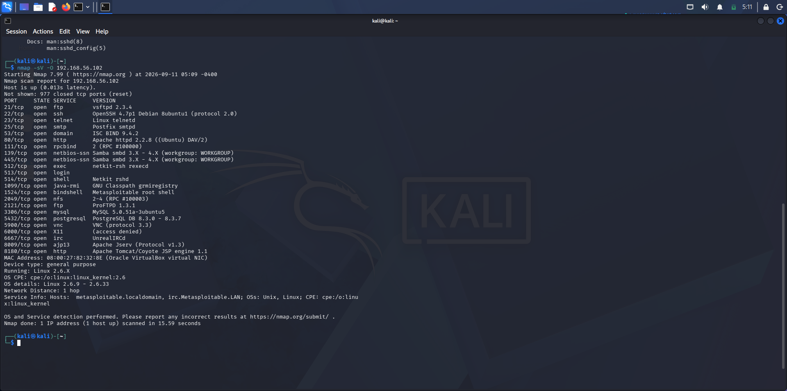

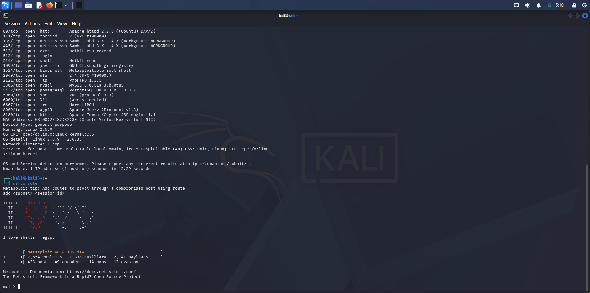

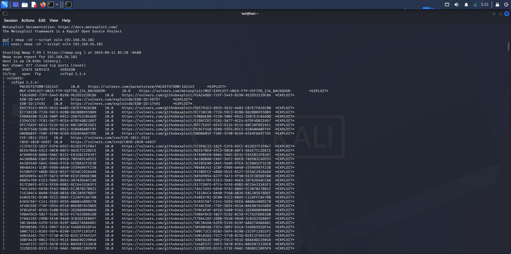

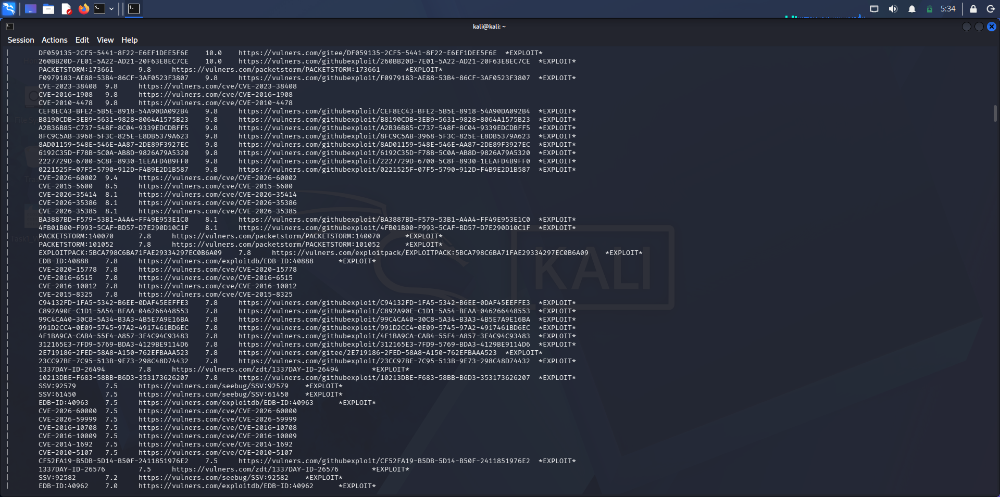

## 3. Vulnerability Findings

Multiple intentionally vulnerable services were observed during the assessment.

### Evidence

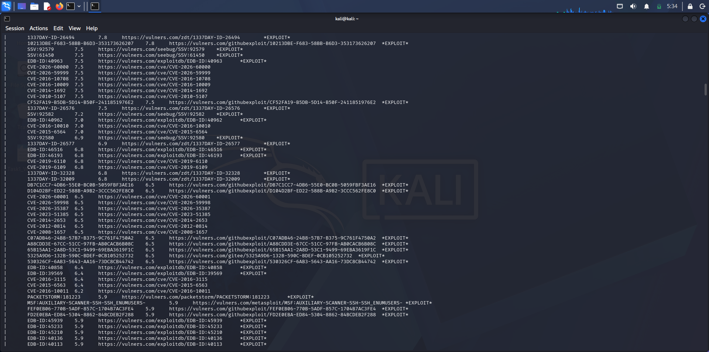

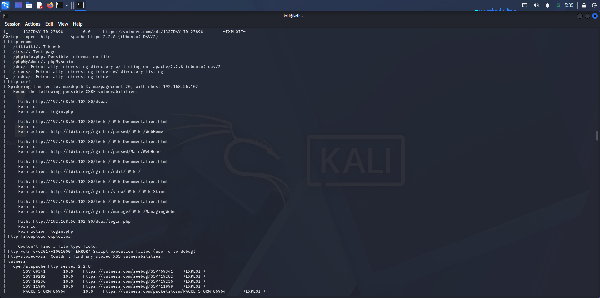

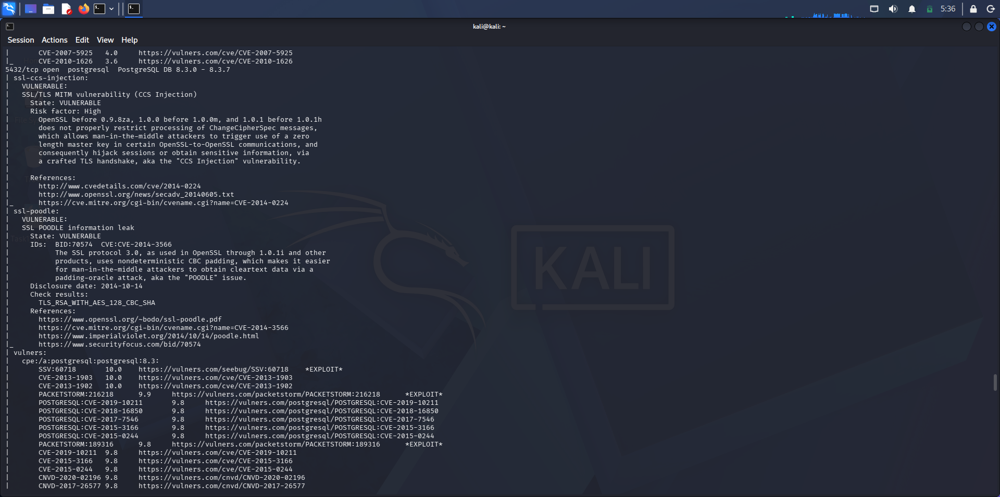

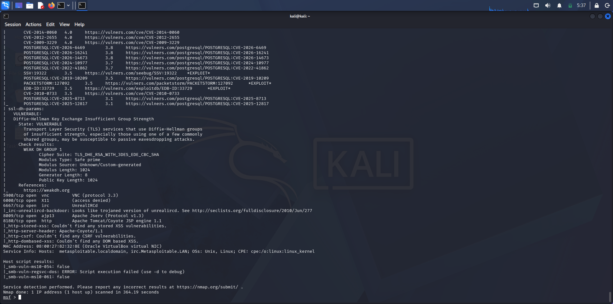

## 4. VSFTPD 2.3.4 — Vulnerability Validation

TCP/21 was identified as running **vsftpd 2.3.4**. Metasploit was used to identify the `exploit/unix/ftp/vsftpd_234_backdoor` module.

The module information identifies the historical VSFTPD backdoor and **CVE-2011-2523**.

**Impact:** A vulnerable/backdoored FTP service can enable unauthorized command execution and compromise of the target.

**Mitigation:** Remove or upgrade the vulnerable service, restrict FTP exposure, prefer secure file-transfer protocols, and monitor authentication/service logs.

### Evidence

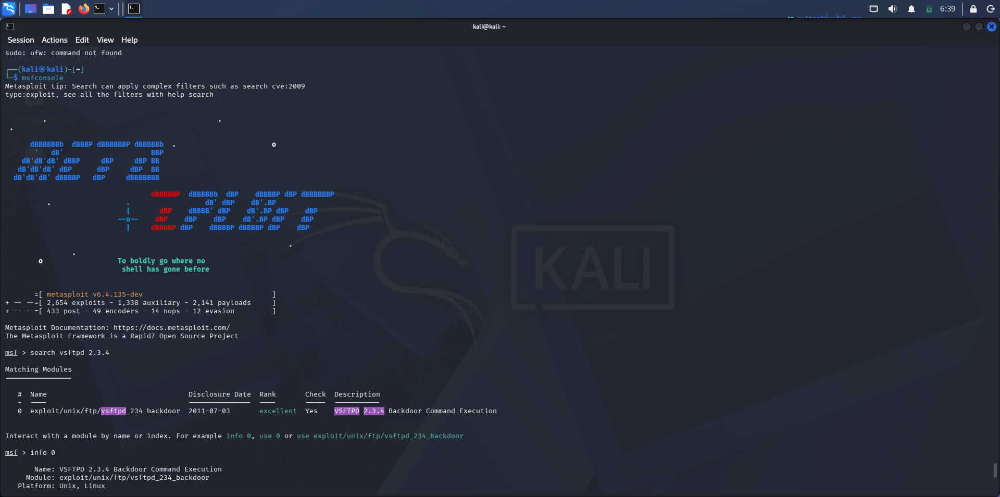

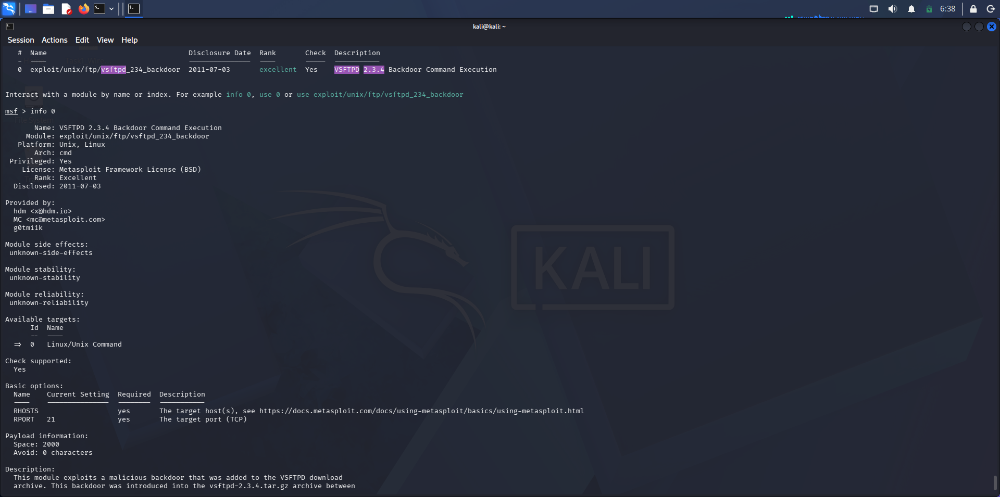

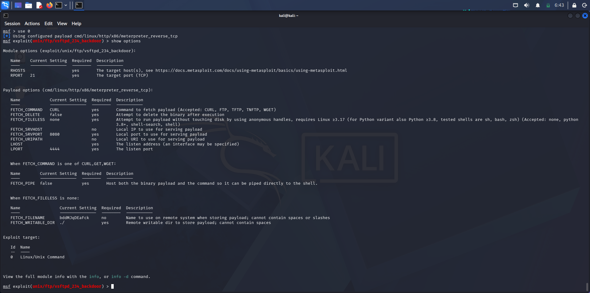

## 5. SSH Security Assessment

SSH was observed on TCP/22. Algorithm enumeration showed legacy options including SHA-1-based key-exchange algorithms, SSH-RSA/SSH-DSS host-key algorithms, older CBC/ARCFOUR-style encryption options and legacy MACs.

**Recommendation:** Modernize the SSH configuration and disable deprecated algorithms.

### Evidence

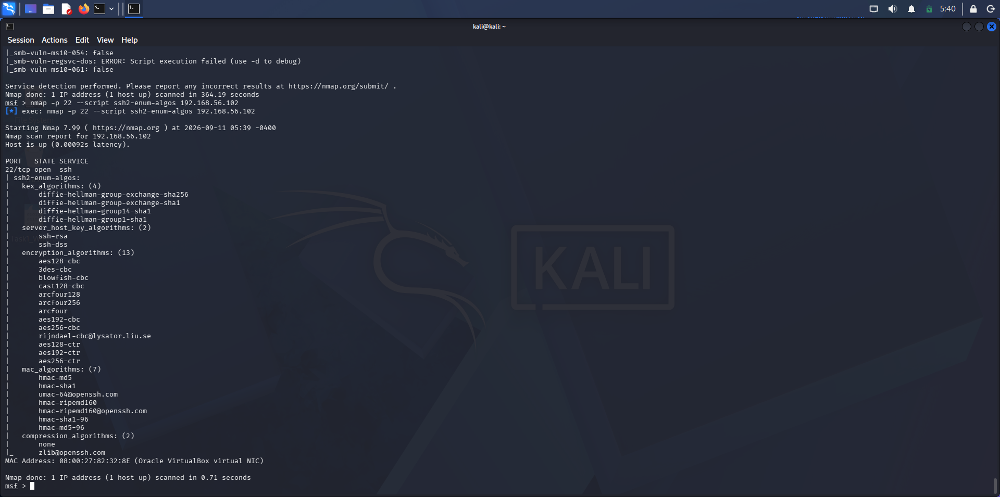

The saved SSH algorithm output is also included in the repository as `SSH-algorithm output`.

## 6. System Hardening Assessment

The lab included checks for firewall state, listening services and patch/upgrade status.

### Recommended hardening

- Restrict inbound traffic using least-privilege firewall rules
- Disable unnecessary network services
- Apply security updates
- Re-scan after remediation

### Evidence

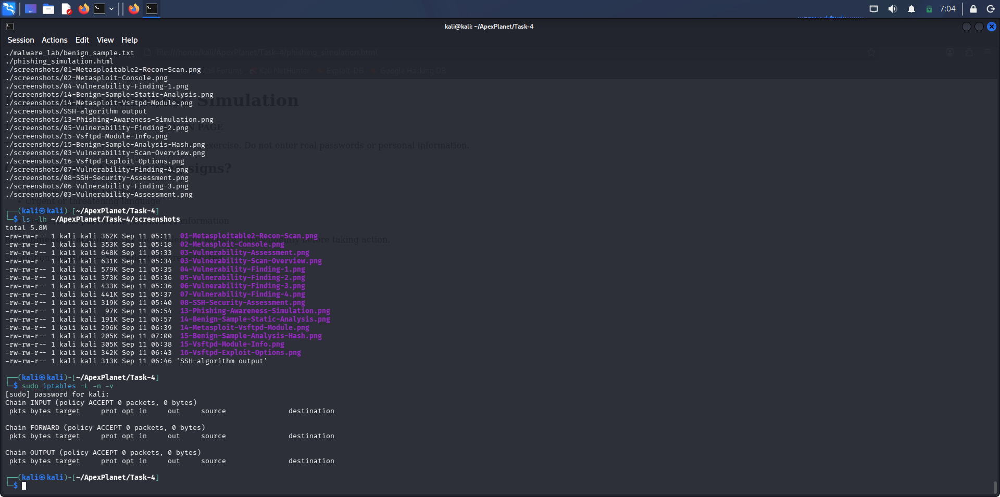

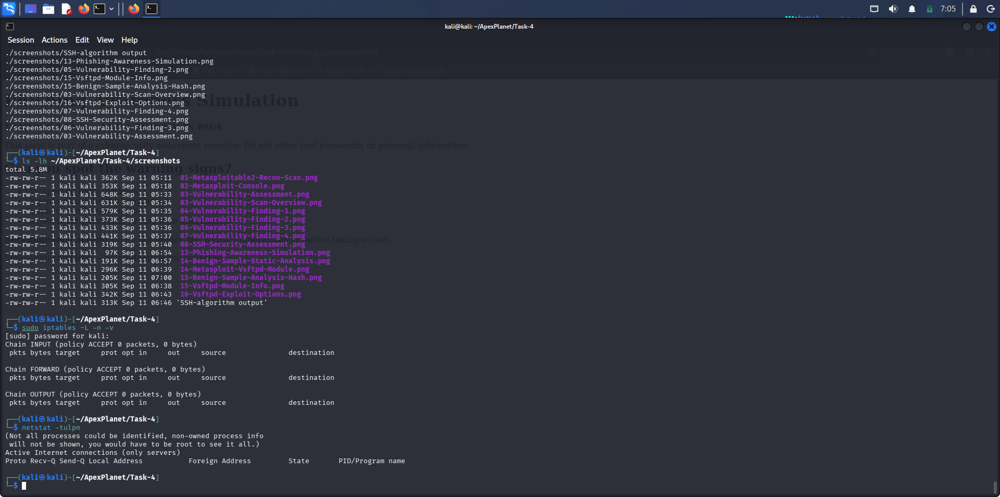

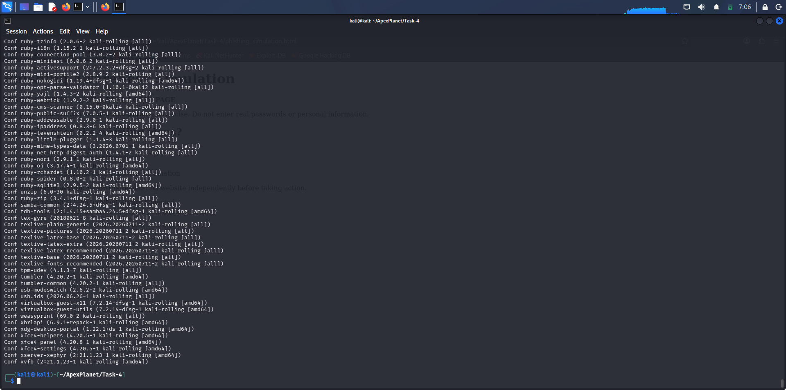

## 7. Social Engineering — Awareness Simulation

A local **training-only phishing awareness page** was created. It is explicitly an awareness demonstration and does not collect, store or transmit credentials.

### Evidence

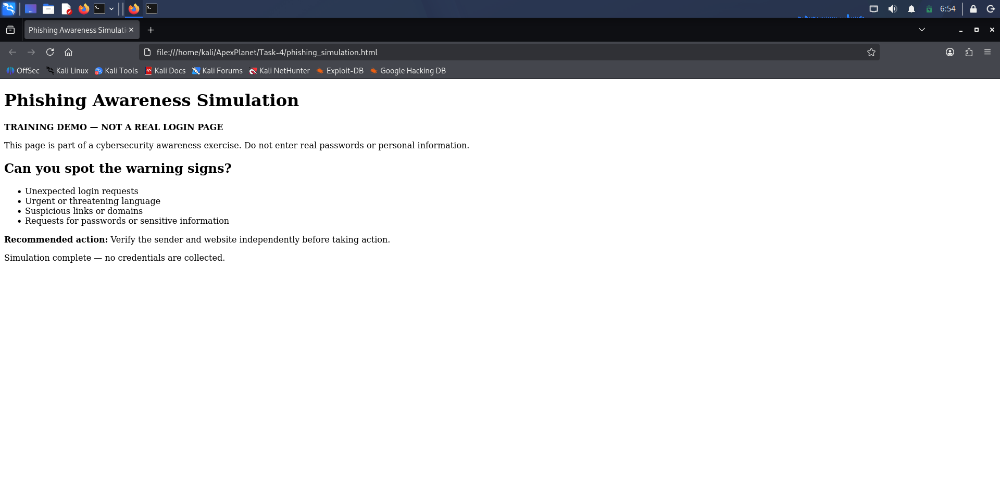

## 8. Malware Basics — Benign Static Analysis

A harmless text sample was used to demonstrate basic static analysis. The sample was identified as ASCII text and its SHA-256 hash was recorded.

**SHA-256:**

`fbe0bc72ac2e53e449c6ef65f1f6c2acc9b3fe16e1758f33d25a8535fec7f6d6`

No malware was executed during this exercise.

### Evidence

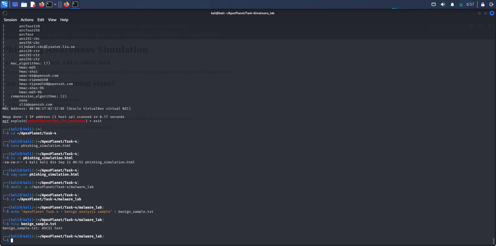

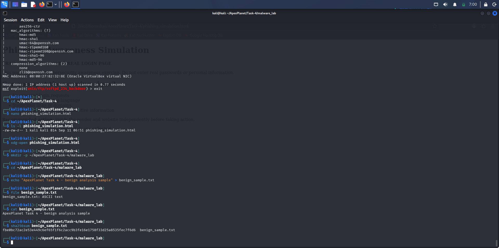

## 9. Risk & Mitigation Summary

| Area | Evidence-based observation | Recommended mitigation |
|---|---|---|
| FTP | vsftpd 2.3.4 exposed; VSFTPD backdoor module identified | Upgrade/remove service; restrict exposure; use secure transfer |
| SSH | Legacy algorithms enumerated | Disable deprecated algorithms; update OpenSSH |
| Services | Multiple network services exposed | Disable unnecessary services; restrict access |
| Firewall | Firewall state assessed | Apply least-privilege inbound rules |
| Patching | Patch state assessed | Apply security updates and re-scan |
| Phishing | Awareness simulation created | Train users to verify senders, links and requests |
| Malware | Benign sample analyzed statically | Use isolated sandboxes for real samples |

## 10. Conclusion

This controlled lab assessment demonstrates a practical cybersecurity workflow from reconnaissance through vulnerability identification, security configuration review, awareness simulation and basic malware-analysis concepts.

The strongest evidence supports the identification of the vulnerable **VSFTPD 2.3.4** service and the need for system hardening through patching, service reduction, firewall restrictions and modern SSH configuration.

All testing was performed in the intentionally vulnerable, isolated VirtualBox lab environment.

## ⚠️ Lab Safety Note

This project was performed for educational purposes in a controlled lab using Metasploitable2. No unauthorized external systems were targeted.
